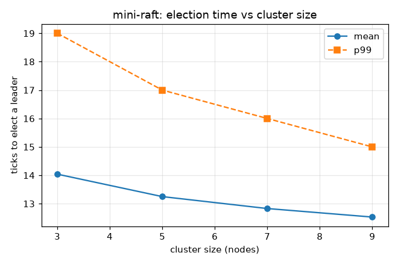
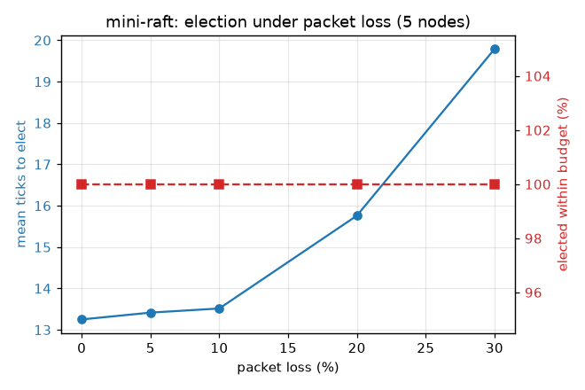
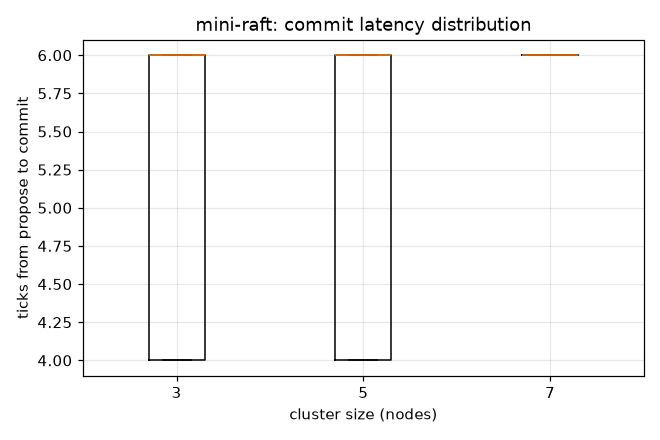

# Benchmarks

All numbers here are produced by `bench/benchmark.py` and are reproducible:

```
python bench/benchmark.py
```

It writes the three graphs below plus `bench/results/summary.json`.

## A note on units

Time is measured in **simulation ticks**, not milliseconds. One tick is a single
round of message delivery plus one `tick()` on every node. I use ticks on purpose so
the numbers are identical on my laptop and in CI - wall-clock timing on the
simulator would just measure Python startup noise. A tick maps onto a real network
round-trip when you drive the node logic with a real transport.

Each data point is the result of **200 independent randomized trials** (different
seeds), so the percentiles are real distribution percentiles, not single runs.

## Election time vs cluster size



| Nodes | Mean | P50 | P99 | Elected within budget |
|:-----:|:----:|:---:|:---:|:---------------------:|
| 3 | 14.0 | 13 | 19 | 99% |
| 5 | 13.3 | 13 | 17 | 100% |
| 7 | 12.8 | 13 | 16 | 100% |
| 9 | 12.5 | 12 | 15 | 100% |

Election time is essentially flat as the cluster grows - a bigger cluster doesn't
elect noticeably slower, because a candidate only needs a majority to respond, not
everyone. The P99 actually tightens slightly with more nodes since there are more
independent timeouts to break a tie quickly.

## Election under packet loss (5 nodes)



| Packet loss | Mean ticks | P99 | Elected within budget |
|:-----------:|:----------:|:---:|:---------------------:|
| 0% | 11.5 | 17 | 100% |
| 5% | 13.4 | 22 | 100% |
| 10% | 13.5 | 24 | 100% |
| 20% | 15.8 | 38 | 100% |
| 30% | 19.8 | 57 | 100% |

This is the graph I care about most. As the network drops more messages, the cluster
still always elects a leader within the budget - it just takes longer, and it
degrades *gracefully*: mean election time roughly doubles from 0% to 30% loss while
the tail (P99) grows faster, exactly the shape you'd expect when retries have to
paper over lost votes. Nothing falls off a cliff.

## Commit latency



| Nodes | Mean | P50 | P99 | P99.9 |
|:-----:|:----:|:---:|:---:|:-----:|
| 3 | 5.2 | 6 | 6 | 6 |
| 5 | 5.5 | 6 | 6 | 6 |
| 7 | 5.6 | 6 | 6 | 6 |

Once a leader exists, getting a proposal committed is cheap and stable: propose ->
heartbeat replicates -> majority acks -> commit index advances. It's flat across
cluster sizes because commitment waits on a majority, and the median/tail sit right
on top of each other because, absent faults, replication is a fixed handful of ticks.

## What this does and doesn't tell you

It tells you the algorithm's *shape* is right: election cost is bounded and roughly
size-independent, it survives heavy loss, and commit latency is stable. It does not
give you production millisecond SLAs - that depends on your real timers and network,
which is exactly why the design doc lists a real transport as future work.
