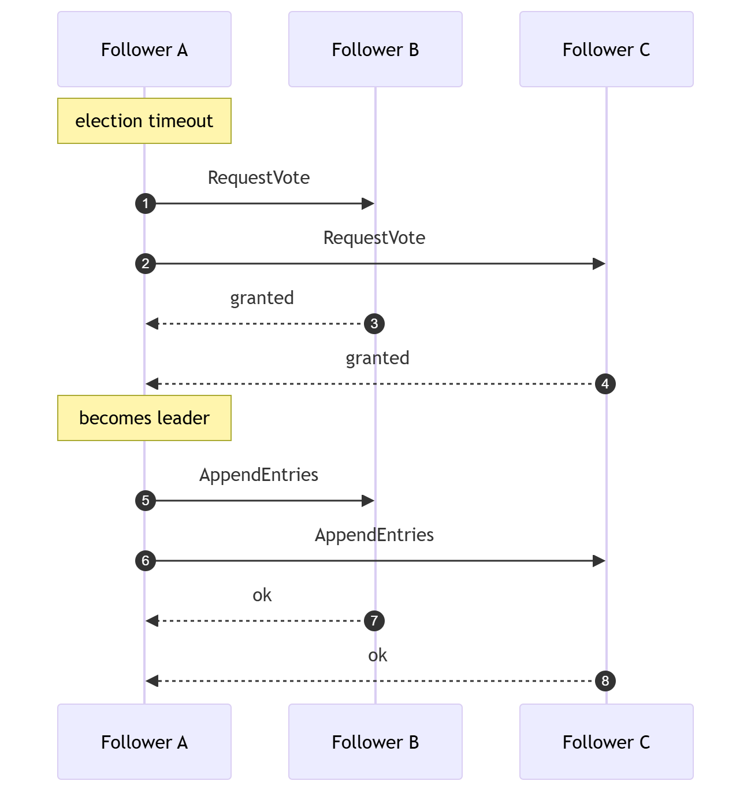

# coracle: design, trade-offs, and non-goals

Status: accepted
Author: Parag Sawant

This is the reasoning behind coracle. I wrote it up because a consensus library
that you can't reason about is worse than no library - if you're going to trust it
with "who is the leader and what is the log," you should be able to see exactly what
it does and where it stops.

## Problem and goals

I wanted one implementation of Raft I could actually read end to end, that gets the
safety rules right, and that I could test hard without spinning up processes or
fighting timing flakiness. Concretely:

1. Correct leader election and log replication, including the parts people skip -
   the election restriction, conflict truncation, and the current-term commit rule.
2. Deterministic and reproducible, so a failing schedule can be replayed exactly.
3. Small enough to read in a sitting.

*(The same diagram renders inline as Mermaid in the [README](README.md#how-it-works); this PNG is a static export.)*

## Key design decision: the node does no I/O

The single biggest choice here is that a `RaftNode` never touches a clock or a
socket. It is a pure state machine with two entry points:

- `tick()` advances its own timers and returns the messages it wants sent.
- `handle(msg)` processes one inbound RPC and returns the replies.

All time and networking live in a separate `Cluster` that advances every node one
step and routes the messages. I did it this way for three reasons:

- **Testability.** Safety is a property over *all* message schedules. If the node
  owned its own threads and timers, I could only test the schedules that happened to
  occur. With delivery under the simulator's control, the chaos suite can drop,
  duplicate, reorder, and partition messages on purpose and assert the invariants
  after every step.
- **Determinism.** A seed fully determines a run, so a bug found in CI reproduces on
  my laptop bit for bit. No `sleep`, no flakiness.
- **Portability.** The same node logic could be driven by a real transport later
  without touching the algorithm.

The trade-off is that this is not a runnable server. That's a deliberate non-goal
(below).

## Trade-offs I made on purpose

- **Time is measured in ticks, not milliseconds.** A tick is one delivery round plus
  one tick per node. This makes benchmarks reproducible on any machine, at the cost
  of not producing wall-clock latency numbers. For an algorithm study that's the
  right trade; for a production deployment you'd map ticks onto a real timer.
- **Randomized election timeouts in `[T, 2T)`.** Straight from the paper - equal
  timeouts split the vote forever. The deterministic default staggers by node id;
  the seeded mode randomizes, which is what the benchmarks use.
- **Backtracking `nextIndex` one step at a time on rejection.** Simple and obviously
  correct. The paper mentions a faster conflict-term optimization; I left it out
  because it complicates the code and the point here is clarity. Noted as future
  work.
- **In-memory log, no fsync.** There's no persistence layer, so a "crash" in this
  model is really "isolate then heal," not "lose the disk." Real Raft must persist
  `currentTerm`, `votedFor`, and the log before responding; that boundary is called
  out as a non-goal rather than faked.

## Safety argument (what the tests actually enforce)

The chaos suite checks three invariants after essentially every simulated step,
across drops, duplication, reordering, rolling partitions, and a 25-schedule soak:

- **Election safety** - at most one leader per term.
- **State-machine safety** - no two nodes ever apply a different command at the same
  log index.
- **Commit durability** - once a command is applied at an index, that index never
  changes.

Liveness is checked separately and only where Raft actually promises it: once the
network is healed, a majority converges on the leader's committed log.

## Non-goals

- **Not a server.** No RPC transport, no persistence, no crash-recovery from disk.
  This is the algorithm and a test harness, not a datastore.
- **No membership changes.** Joint-consensus reconfiguration is out of scope; the
  cluster is fixed at construction.
- **No log compaction / snapshotting.** The log grows without bound.
- **No client session layer.** Proposals are idempotent only to the extent the log
  makes them; there's no dedup of client request ids.

These are the natural next chapters, and they're listed so nobody mistakes the scope
for more than it is.

## Benchmarks

See `BENCHMARKS.md`. Short version: with 5 nodes, a leader is elected in ~11 ticks
median and stays 100% reliable up to 30% packet loss (P99 election time degrades
from 17 to 57 ticks as loss climbs, which is the graceful shape you want), and
commit latency holds flat at ~5-6 ticks regardless of cluster size.
