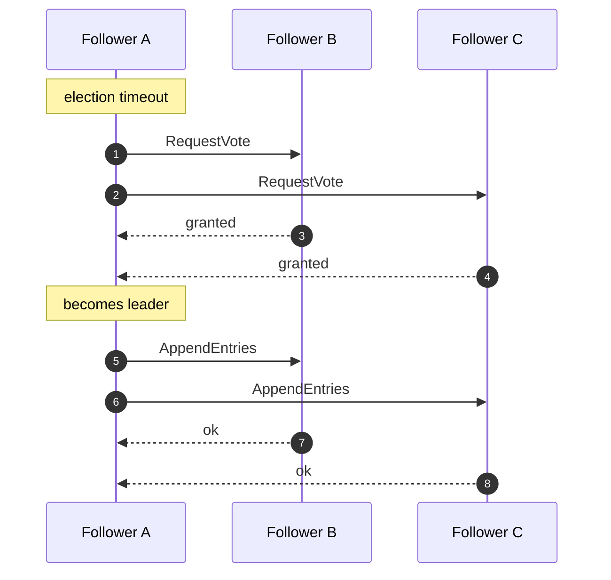

# mini-raft

A small, readable implementation of the [Raft](https://raft.github.io/) consensus
algorithm - leader election and log replication - with a deterministic simulator so
you can watch an election happen, isolate a leader, partition the network, and see
the cluster stay consistent.

## Why

Every distributed system eventually needs agreement on a single ordered history:
who is the leader, and what is the log. Raft is the algorithm most teams reach for,
but the papers and production implementations are dense. I wanted a version small
enough to read in one sitting that still gets the safety rules right - the election
restriction, conflict truncation, and the current-term commit rule - so it can be a
reference, not a black box.

## The design that makes it testable

A node never touches the clock or the network. It's a pure state machine:

- `tick()` advances its timers and returns any messages to send.
- `handle(message)` processes one inbound RPC and returns the replies.

All the time and I/O live in a `Cluster` simulator that advances every node one
step and routes messages. Because nothing is threaded or wall-clock driven, an
entire election or replication round replays identically every run - which is how
the tests can assert exact behavior like "a minority partition can never commit."

```python
from raft import Cluster

c = Cluster(5)
leader = c.run_until_leader()      # elect
leader.propose("set x = 1")        # replicate
c.run(40)
assert c.committed_commands(0) == ["set x = 1"]   # applied on every node

c.isolate(leader.id)               # kill the leader
new_leader = c.run_until_leader()  # the majority elects a new one
```

## What it implements

- **Leader election** with staggered (deterministically randomized) timeouts, term
  increments, and the up-to-date-log voting restriction.
- **Log replication** with `prev_log` consistency checks, conflict truncation, and
  `next_index` back-off so a lagging follower is backfilled to a full match.
- **Commit safety** - a leader only advances the commit index once an entry from its
  current term is stored on a majority.
- **Network faults** - partition, heal, and isolate links to exercise split-brain
  scenarios.

## Tests

| Suite | What it proves | Tests |
|-------|----------------|:-----:|
| `test_log` | matching, conflict truncation, election restriction | 6 |
| `test_election` | one leader emerges; re-election after isolation; stale candidates denied | 6 |
| `test_replication` | in-order apply, catch-up, minority cannot commit | 5 |
| `test_chaos` | safety holds under drops, duplication, reordering, rolling partitions, and a soak | 4 |

```
cd python && pytest -q
```

## Design notes and numbers

- **[DESIGN.md](DESIGN.md)** - why the node does no I/O, the trade-offs I made on purpose,
  the safety argument, and the non-goals (it's an algorithm + harness, not a server).
- **[BENCHMARKS.md](BENCHMARKS.md)** - measured election time, behavior under packet
  loss, and commit latency, with graphs. Reproduce with `python bench/benchmark.py`.
- **Chaos suite** (`python/tests/test_chaos.py`) - drives the cluster with a lossy,
  out-of-order, duplicating network and rolling partitions and asserts Raft's safety
  invariants after every step.

## Known limitations

- **In-memory only.** There's no on-disk persistence or real RPC transport - this is
  the algorithm, not a server. The state machine is deliberately separable so a real
  transport could drive the same node logic.
- **No membership changes or snapshotting.** Joint-consensus reconfiguration and log
  compaction are the natural next chapters and aren't implemented here.

## How it works



## Layout

```
mini-raft/
├── python/         the Raft implementation + a deterministic simulator (pytest)
├── bench/          benchmark.py - election and replication timing
├── docs/diagrams/  architecture diagrams
├── DESIGN.md       leader election, log replication, the safety argument
└── BENCHMARKS.md   reproducible numbers
```


Part of [parag-labs](https://github.com/parag-labs) - small, focused tools for building systems you can trust.
